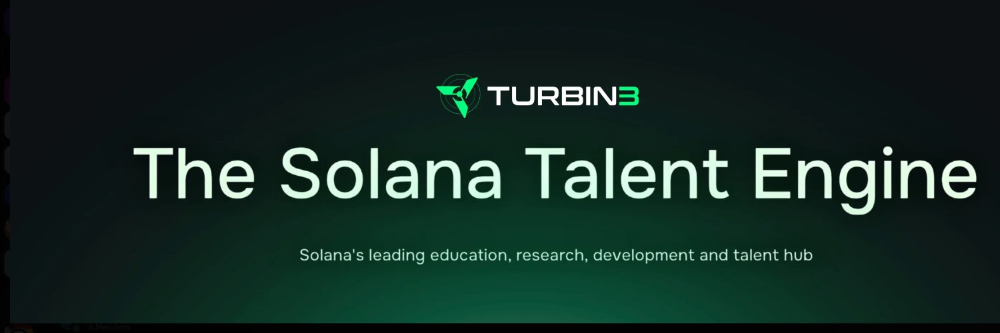

# Learning Solana Development Journey with Turbin3

This repository documents my personal learning journey through the Turbin3 program. All projects, exercises, and progress are tracked here as I develop my Solana blockchain development skills.

## Project Structure

| Project | Description |
|---------|-------------|
| `hello_world/` | Basic Rust Hello World program |
| `counter/` | Rust counter program |
| `rng_game/` | Random number game in Rust |
| `hello_solana/` | Solana Hello World using Anchor framework |
| `counter_solana/` | Solana counter dApp with Anchor |
| `test-ledger/` | Local Solana test environment |