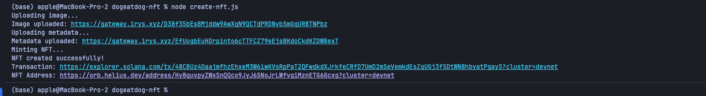
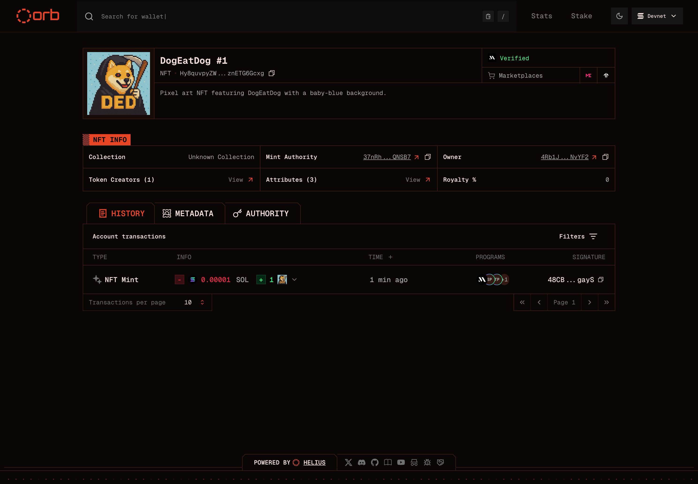

# DogEatDog NFT Minter

This script mints a programmable NFT on Solana Devnet by uploading your image and metadata to Arweave, then creating the on-chain asset using your local wallet.

## Setup Your Wallet

### Install Solana CLI
If you don't have Solana CLI installed:
```bash
sh -c "$(curl -sSfL https://release.solana.com/stable/install)"
```
Restart your terminal after installation.

### Create or Import Your Keypair
Choose one option:

**Option 1: Generate a new wallet**
```bash
solana-keygen new --no-bip39-passphrase
```

**Option 2: Import existing wallet (from Phantom, etc.)**
```bash
solana-keygen recover ASK
```
Enter your base58 private key when prompted.

Your keypair will be saved to `~/.config/solana/id.json` as a JSON array of numbers.

### Get Devnet SOL
```bash
solana airdrop 2 --url devnet
```

## Configure Your NFT

Edit `create-nft.js` to customize your NFT:

- **Line 22**: Update image filename if different from `0.png`
- **Lines 29-42**: Modify NFT metadata including name, description, and attributes

Place your NFT image in `assets/images/` directory.

## Installation

```bash
npm install
```

## Mint Your NFT

```bash
node create-nft.js
```

The script will output explorer links to view your transaction and NFT.

## Output Examples

### Terminal Output


### View on Helius

