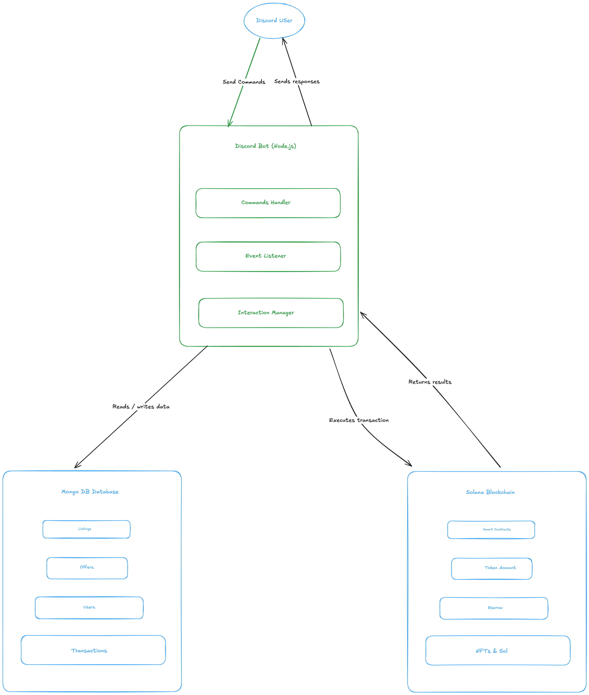

# NFT Marketplace on Solana

A decentralized NFT marketplace built on Solana with a Discord bot interface for listing, buying, and managing NFT sales.

## Architecture

### System Overview


### Transaction Flow


## Features

- **List NFTs** - Put your NFTs up for sale with custom pricing
- **Buy NFTs** - Purchase listed NFTs with automatic escrow handling
- **Cancel Listings** - Withdraw your NFTs from the marketplace
- **Browse Listings** - View all active listings with metadata and images
- **Wallet Management** - Create or import Solana wallets via Discord

## Tech Stack

| Layer | Technology |
|-------|------------|
| Blockchain | Solana |
| Smart Contract | Anchor 0.31.1 (Rust) |
| Bot | Discord.js 14.x (TypeScript) |
| Client SDK | @coral-xyz/anchor, @solana/web3.js |
| Testing | Mocha, Chai |

## Project Structure

```
nft-marketplace-telegram/
├── programs/nft_marketplace/     # Solana smart contract
│   └── src/
│       ├── lib.rs                # Program entry point
│       ├── error.rs              # Custom errors
│       ├── state/                # Account structures
│       │   └── listing.rs        # Listing account
│       └── instructions/         # Program instructions
│           ├── list_nft.rs       # List NFT for sale
│           ├── buy_nft.rs        # Purchase NFT
│           └── cancel_listing.rs # Cancel listing
├── bot/                          # Discord bot
│   └── src/
│       ├── index.ts              # Bot entry point
│       ├── commands/             # Slash commands
│       │   ├── wallet.ts         # /wallet
│       │   ├── list.ts           # /list
│       │   └── browse.ts         # /browse
│       └── services/             # Business logic
│           ├── solana.service.ts
│           ├── marketplace.service.ts
│           └── nft.service.ts
├── tests/                        # Integration tests
├── docs/                         # Architecture diagrams
└── target/                       # Build output & IDL
```

## Smart Contract

### Program ID
```
5rLugYKFCru2oZ47qpwcGgJW42U2XuYXD69qDWh74Fhg
```

### Instructions

| Instruction | Description |
|-------------|-------------|
| `list_nft(price_in_sol)` | List an NFT for sale. Transfers NFT to escrow PDA. |
| `buy_nft()` | Purchase a listed NFT. Transfers SOL to seller, NFT to buyer. |
| `cancel_listing()` | Cancel listing and return NFT to seller. |

### Account Structure

```rust
pub struct Listing {
    pub listing_id: Pubkey,        // Unique identifier
    pub seller: Pubkey,            // Seller's wallet
    pub nft_mint: Pubkey,          // NFT mint address
    pub nft_token_account: Pubkey, // Escrow token account
    pub price_sol: u64,            // Price in lamports
    pub created_at: i64,           // Unix timestamp
    pub is_active: bool,           // Listing status
    pub bump: u8,                  // Listing PDA bump
    pub escrow_bump: u8,           // Escrow PDA bump
}
```

### PDAs

| PDA | Seeds | Purpose |
|-----|-------|---------|
| Listing | `["listing", seller, nft_mint]` | Stores listing metadata |
| Escrow | `["escrow", listing]` | Holds NFT during sale |

## Discord Bot Commands

| Command | Description |
|---------|-------------|
| `/wallet` | Create or import a Solana wallet, view balance |
| `/list <mint> <price>` | List an NFT for sale |
| `/browse [page]` | Browse all active listings |
| `/ping` | Test bot connectivity |

## Setup

### Prerequisites

- Rust & Cargo
- Solana CLI
- Anchor CLI (0.31.1)
- Node.js 18+ or Bun
- Yarn

### Installation

1. **Clone and install dependencies**
   ```bash
   git clone <repository>
   cd nft-marketplace-telegram
   yarn install
   cd bot && yarn install
   ```

2. **Build the smart contract**
   ```bash
   anchor build
   ```

3. **Configure the bot**
   ```bash
   cd bot
   cp .env.example .env
   # Edit .env with your Discord tokens and Solana RPC
   ```

4. **Register Discord commands**
   ```bash
   cd bot
   yarn register
   ```

### Environment Variables

```env
# Discord
DISCORD_TOKEN=your_bot_token
DISCORD_CLIENT_ID=your_app_id
DISCORD_GUILD_ID=your_server_id

# Solana
SOLANA_RPC_URL=https://api.devnet.solana.com
SOLANA_CLUSTER=devnet

# Program
NFT_MARKETPLACE_PROGRAM_ID=5rLugYKFCru2oZ47qpwcGgJW42U2XuYXD69qDWh74Fhg
```

## Running

### Local Development

1. **Start local validator**
   ```bash
   solana-test-validator
   ```

2. **Deploy contract**
   ```bash
   anchor deploy
   ```

3. **Run bot**
   ```bash
   cd bot
   yarn dev
   ```

### Testing

Run the integration tests:
```bash
anchor test
```

Tests cover:
- Listing NFTs for sale
- Buying listed NFTs
- Canceling listings
- Error cases (invalid NFT, unauthorized cancel, insufficient funds)

## Usage Flow

### Listing an NFT

1. User runs `/wallet` to create/import wallet
2. User runs `/list <nft_mint_address> <price_in_sol>`
3. Bot calls `list_nft` instruction
4. NFT is transferred to escrow PDA
5. Listing appears in `/browse`

### Buying an NFT

1. User runs `/browse` to see listings
2. User clicks "Buy" button on desired NFT
3. Bot calls `buy_nft` instruction
4. SOL transfers to seller, NFT transfers to buyer
5. Listing marked as inactive

### Canceling a Listing

1. Seller calls cancel through the program
2. NFT returns from escrow to seller
3. Listing marked as inactive

## Security

- NFTs held in program-controlled escrow PDAs
- Only original seller can cancel listings
- Atomic transactions ensure no partial states
- Price validation prevents zero-cost listings

## License

MIT
